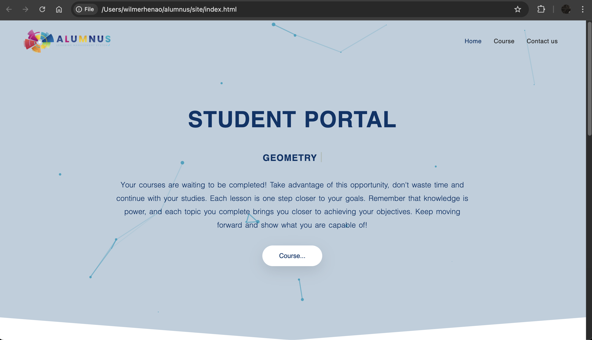
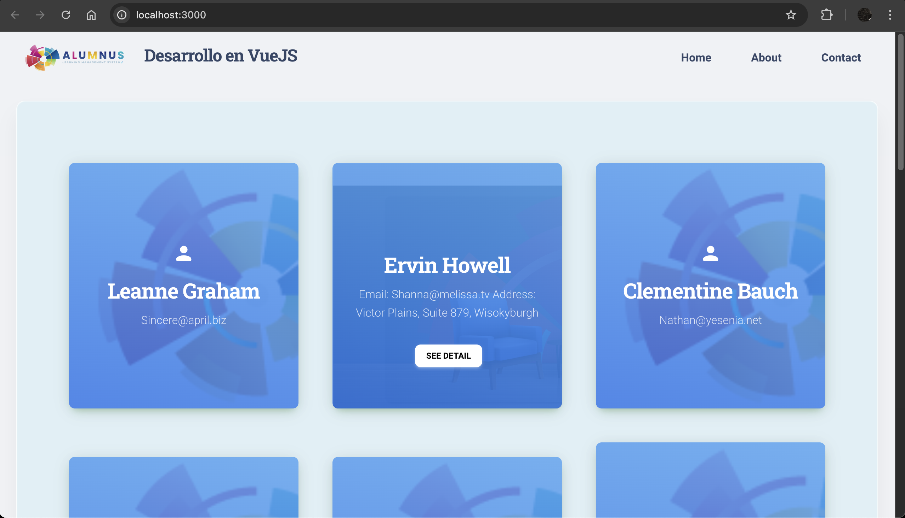
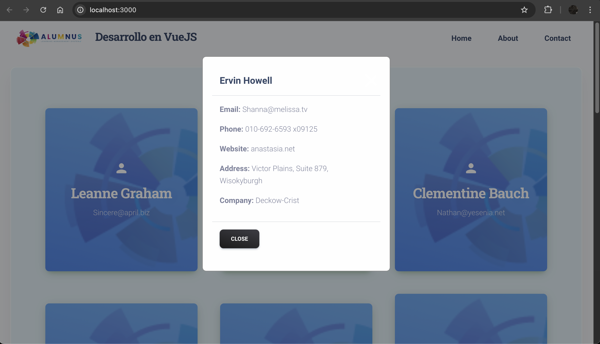

# Prueba Técnica - Alumnus

## Instalación

1. Clonar el repositorio:

    ```sh
    git clone https://github.com/henaowilmer/technical-test-alumnus.git
    ```

2. Navegar al directorio del proyecto:

    ```sh
    cd technical-test-alumnus
    ```

---

## Parte 1: Maquetación de Interfaz (30 puntos)

### Tarea:

Crea una página simple utilizando HTML y CSS que represente un "Portal de Estudiantes". La página debe incluir:

- Un encabezado con el título "Portal de Estudiantes".
- Una sección con una lista de cursos (puedes usar datos ficticios).
- Un botón que diga "Ver Detalles" para cada curso.
- Un pie de página con información de contacto.

Para ver el desarrollo de la parte 1, abre el archivo `index.html` que se encuentra en el directorio `site`.



---

## Parte 2: Desarrollo en VueJS (50 puntos)

### Tarea:

Utilizando VueJS3, crea una aplicación simple que consuma una API REST pública (puedes usar [JSONPlaceholder](https://jsonplaceholder.typicode.com/) como referencia). La aplicación debe mostrar una lista de usuarios y permitir al usuario hacer clic en un nombre para ver más detalles (nombre, correo electrónico y dirección).

Para ver el desarrollo de la parte 2:

1. Navegar al directorio del proyecto de Vue:

    ```sh
    cd technical-test-alumnus/vue
    ```

2. Instalar las dependencias:

    ```sh
    npm install
    ```

### Uso

Iniciar el servidor de desarrollo:

```sh
npm run serve
```

Abrir el navegador y navegar a http://localhost:3000 para ver la aplicación en funcionamiento.

### Requisitos

Node.js v14 o superior
npm v6 o superior



---

## Parte 3: Consumo de API y Manejo de Datos (20 puntos)

### Tarea:

Agrega funcionalidad a tu aplicación VueJS para que, al hacer clic en un usuario, se muestre un modal con la información detallada del usuario seleccionado. Incluye un botón para cerrar el modal.
Para ver el desarrollo de la parte 3, está sobre el mismo desarrollo de la parte 2, por lo que no tienes que hacer acciones adicionales.


---

## Parte 4: Preguntas Teóricas (10 puntos)

### Tarea:

Agrega funcionalidad a tu aplicación VueJS para que, al hacer clic en un usuario, se muestre un modal con la información detallada del usuario seleccionado. Incluye un botón para cerrar el modal.
Para ver el desarrollo de la parte 3, está sobre el mismo desarrollo de la parte 2, por lo que no tienes que hacer acciones adicionales.


Pregunta 1: Explica brevemente qué es Vue.js y cuáles son sus principales características.

Vue.js es un framework de JavaScript que facilita la construcción de interfaces de usuario y aplicaciones de una sola página (SPA). Su enfoque es la reactividad de los datos, permitiendo que la interfaz responda automáticamente a los cambios de estado.

Características:
Reactividad
Componentes
Simplicidad y facilidad de aprendizaje
Progresivo


Pregunta 2: ¿Qué es una API REST y cuáles son sus principios básicos?

Es un estilo de arquitectura que define un conjunto de restricciones para crear servicios web. Se basa en el protocolo HTTP para gestionar la comunicación entre el cliente y el servidor.

Principios básicos:
Cliente-servidor
Cacheable
Interfaz uniforme: utiliza métodos HTTP estándar como GET, POST, PUT y DELETE
Sistema en capas


Pregunta 3: ¿Cuál es la diferencia entre props y data en Vue.js?

En Vue.js, props y data se utilizan para manejar y manipular datos dentro de componentes, pero con roles distintos.
Props: se utilizan para pasar datos desde un componente padre a un componente hijo.
Data: es el estado local del componente y representa los datos que el propio componente puede gestionar y modificar.